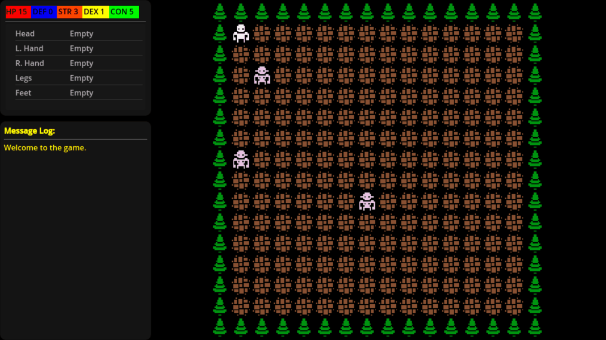

# These Hills
> A survival broughlike about getting lost in the backwoods and finding your way home, all while the creatures living in the woods track you down.

## Goals
My main goal with this project is to get some practice with data-driven games in godot, as well as allowing for easy modding. I also wanted to expand on the simple Broughlike genre to allow for longer form gameplay, and combining RPG systems with some simplified survival simulation systems seemed interesting.

## Features
- Data-driven gameplay, all definitions are done through config files
- Simplified survival sim, manage food, water, and rest through hunting, foraging and crafting
- Overworld travel, setup camps in various overworld regions to stockpile resources
- Procedulrally generated backwoods environment
